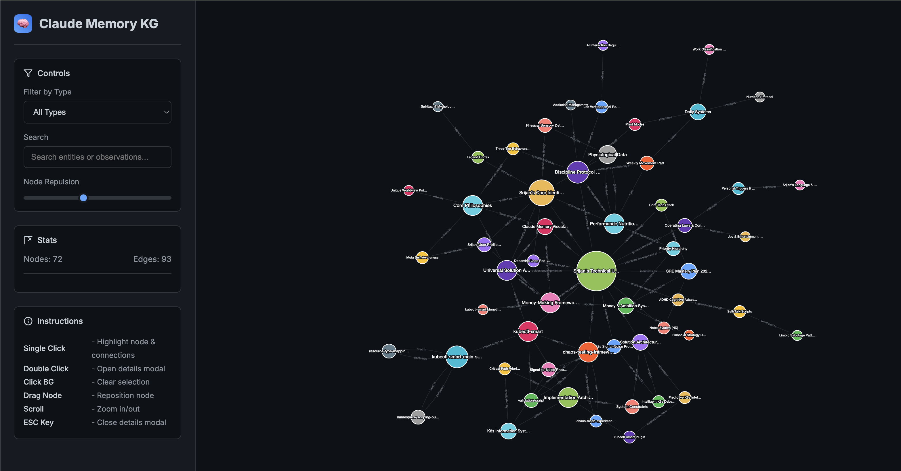

# 🧠 Claude Memory Knowledge Graph Visualizer

**Universal tool to visualize any Claude user's memory.json in a beautiful interactive graph.**


Transform your Claude Memory MCP data into stunning interactive visualizations. See how your AI assistant's knowledge connects and evolves over time.

This is built to work with 

## 📸 What It Looks Like



*Real Claude memory data visualized as an interactive knowledge graph with 72 entities and 93 relationships*

## ✨ Features

- 🎨 **Beautiful Interactive Graph** - Force-directed layout with physics controls
- 🔍 **Smart Filtering** - Filter by entity type or search across all data  
- 🎯 **Rich Tooltips** - Hover to see detailed entity information
- 🌈 **Color-coded Types** - Each entity type gets a unique color
- 📱 **Responsive Design** - Works on any screen size
- ⚡ **Zero Configuration** - Just clone and run!

## 🚀 Quick Start

```bash
# Clone the repo
git clone https://github.com/yourusername/claude-memory-viz
cd claude-memory-viz

# Run the visualizer (automatically finds your memory file!)
python3 serve.py

# Open in browser
# http://localhost:8021
```

That's it! The visualizer automatically finds your Claude memory file from common locations.

## 📁 Memory File Location

The visualizer **automatically searches** for your memory file in this order:

1. **Current directory**: `./memory.json`
2. **User home**: `~/memory.json`  
3. **Code directory**: `~/code/memory.json`
4. **Config directory**: `~/.config/claude/memory.json`
5. **Fallback**: Demo data if no file found

### Custom File Location

```bash
# Use a specific memory file
python3 serve.py ~/my-custom-memory.json

# Custom port + custom file
python3 serve.py 3000 ~/my-custom-memory.json

# Just custom port (auto-find memory file)
python3 serve.py 3000
```

### No Setup Required!

Most users need **zero configuration**:
- If you have Claude Memory MCP running, it likely works automatically
- The tool finds your memory file wherever it is
- Clear guidance if no file is found

### MCP Memory Configuration

If you're setting up Claude Memory MCP for the first time, configure it with:

```json
{
  "mcpServers": {
    "memory": {
      "command": "npx",
      "args": ["-y", "@modelcontextprotocol/server-memory"],
      "env": {
        "MEMORY_FILE_PATH": "/Users/yourusername/code/memory.json"
      }
    }
  }
}
```

## 🎛️ Controls

- **🔍 Filter by Type**: Show only specific entity types (personality, tools, frameworks, etc.)
- **🔎 Search**: Find entities by name or observation content
- **⚡ Physics**: Adjust node repulsion force to spread/cluster nodes
- **🖱️ Mouse Controls**:
  - Click node → Open detailed modal
  - Drag nodes → Reposition manually
  - Scroll → Zoom in/out
  - Click background → Clear selection
- **⌨️ Keyboard**: Press ESC to close modals

## 📊 Memory Format

Supports Claude's standard NDJSON memory format:

```json
{"type":"entity","name":"Example Entity","entityType":"example_type","observations":["observation 1","observation 2"]}
{"type":"relation","from":"Entity A","to":"Entity B","relationType":"connects_to"}
```

Each line is a separate JSON object representing either an entity or relationship.

## 🎨 Visualization Features

### Entity Types
The visualizer automatically detects and color-codes all entity types in your memory:
- **Personality Profiles** 🧑 - Core identity traits
- **Behavioral Systems** ⚙️ - Habits and protocols  
- **Technical Tools** 🛠️ - Professional capabilities
- **Philosophical Frameworks** 🤔 - Belief systems
- **And many more...**

### Node Sizing
- Node size reflects connection count (more connected = larger)
- Hover for quick previews
- Click for full details with all observations and connections

### Physics Engine
- Real-time force-directed layout using Cytoscape.js
- Adjustable repulsion for optimal spacing
- Smooth animations and responsive interactions

## 🛠️ Technical Details

- **Frontend**: Pure HTML/CSS/JavaScript with Cytoscape.js
- **Backend**: Python HTTP server (built-in, no dependencies)
- **Data**: Reads NDJSON format memory files
- **Browser**: Works in any modern browser
- **Performance**: Optimized for large knowledge graphs

## 📝 Demo Mode

If no `memory.json` is found, the visualizer shows demo data with sample entities and relationships so you can explore the interface.

## 🌟 Perfect For

- **Claude Users**: Visualize your accumulated memory and knowledge
- **Researchers**: Analyze knowledge graph structures  
- **Developers**: Understand Claude's memory organization
- **Teams**: Share and explore collective AI interactions

## 🔧 Development

### File Structure
```
claude-memory-viz/
├── index.html          # Main UI and styling
├── graph-cytoscape.js   # Graph visualization logic
├── serve.py            # Python HTTP server
├── memory.json         # Sample memory data
└── README.md           # This file
```

### Customization

#### Modify Colors
Edit the `colorScale` array in `graph-cytoscape.js` to change entity type colors.

#### Adjust Physics
Modify physics parameters in the `physics` object:
- `nodeRepulsion`: How strongly nodes push apart
- `edgeLength`: Ideal distance between connected nodes  
- `gravity`: Central pull force

#### Add Features
The codebase is designed for easy extension. Key entry points:
- `loadData()` - Data loading and parsing
- `createVisualization()` - Graph creation
- `setupEvents()` - Interaction handling

## 🚀 Server Options

```bash
# Default everything (port 8021, auto-find memory file)
python3 serve.py

# Custom port (auto-find memory file)
python3 serve.py 3000

# Custom memory file (default port)
python3 serve.py ~/path/to/memory.json

# Custom port + memory file (any order)
python3 serve.py 3000 ~/path/to/memory.json
python3 serve.py ~/path/to/memory.json 3000

# The server will:
# 1. Search common locations for memory.json
# 2. Copy it locally if found (or use in place)
# 3. Report entity/relation counts
# 4. Provide helpful guidance if no file found
# 5. Start HTTP server with demo data fallback
```

## 🤝 Contributing

Built with the philosophy: **"Solve it once and for all"**

This tool works for ANY Claude user with zero configuration. Contributions welcome!

### Areas for Enhancement
- Additional memory file format support
- Export capabilities (PNG, SVG, PDF)
- Advanced filtering options
- Performance optimizations for very large graphs
- Plugin system for custom entity types

## 📄 License

MIT License - Use freely for any purpose!

## 🔗 Related Projects

- [Model Context Protocol](https://modelcontextprotocol.io/) - The standard powering Claude's memory
- [Claude Memory MCP Server](https://github.com/modelcontextprotocol/servers/tree/main/src/memory) - Official memory server
- [Cytoscape.js](https://cytoscape.org/) - Graph visualization library powering this tool

---

**Made with 🔥 by the Claude community, for the Claude community.**

*Git clone + one command = beautiful knowledge graphs for everyone!*
